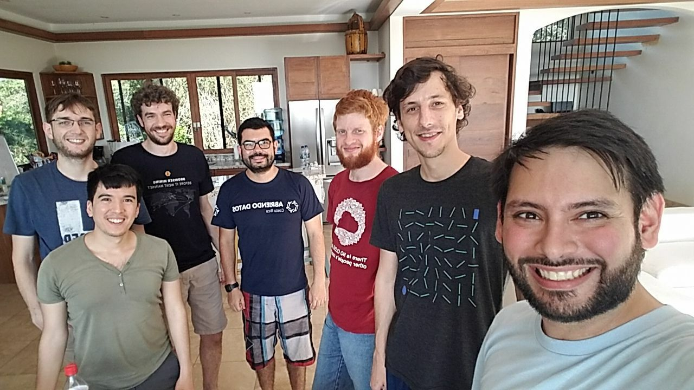

# Week In Review #3
*08 Dec 2017*

Welcome to the third edition of *Week In Review* for the [Nimiq blockchain project](https://nimiq.com).

## Nimiq News
* The Luna testnet was updated with bug fixes and new features - Robin detailed the changes here: [Luna Protocol Update 1](https://medium.com/nimiq-network/luna-protocol-update-1-91f16db62f57)
* A vlog of the team arriving back in Costa Rica was posted to the Youtube channel: [Around The World & Back, CR HQ - Vlog 38](https://www.youtube.com/watch?v=fE17LVmHehY)
 *Photo by Richy on Telegram*
* Robin posted a blog article explaining their choice of identicon for the Nimiq addresses: [Design Blog 2: Identicons](https://medium.com/nimiq-network/devblog-2-identicons-be50dca91d55)

## Code Updates
The first testnet update fixed a lot of problems with including and ordering transactions in blocks. Now the team is again hard at work preparing the next update:
* Marvin implemented generic transactions types to make way for multi-signature wallets and transactions and eventually time-locked contracts (for payment channels, aka. Bitcoins *Lighting Network*)
* Based off of Marvin's new transaction base class, Pascal is working on multi-signature transactions (based on the Collective-Schnorr algorithm)
* Jeff improved the test suite by fixing some problems and adding new tests for the accounts proof
* The README in the master branch got updated to include better instructions for compiling the code yourself: [Quickstart](https://github.com/nimiq-network/core/blob/master/README.md#quickstart)

## Community Projects
* The block explorer [NIMIQ.WATCH](https://nimiq.watch) received an update that enables the viewing of an account's history: both sent and received transactions and mined blocks

---

That's all for now. See you next week!

### *About this newsletter*

With these *Week In Review* articles I hope to bring regular updates of what is publicly happening in the Nimiq blockchain project to the community. This includes a summary of general news and updates from the team, updates on what is being worked on in the public [Github repository](https://github.com/nimiq-network/core) and information about community projects that are worth pointing out.

> This article is fan-created and has no official affiliation with the Nimiq developer team or the Nimiq Foundation. As such this article is not able to talk about inner workings of the team, code in private repositories or plans for the future.

[Last week's news roundup can be found here.](https://nimiq.watch/news/2017-12-01-week-in-review-2.html)
